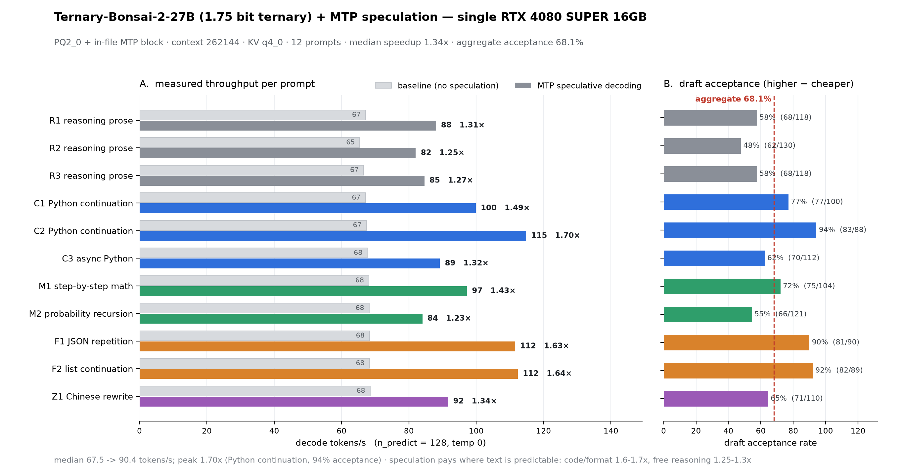

# Bonsai 2 27B + in-file MTP on a 16 GB Ada card — method & measurements

Running [`prism-ml/Ternary-Bonsai-2-27B`](https://huggingface.co/prism-ml/Ternary-Bonsai-2-27B-gguf)
(a 27B **ternary** model, 1.75 bit/weight, 5.95 GB) with **MTP speculative decoding** on a single
16 GB **Ada (SM89)** card, and the two things that had to be fixed to get there:

1. **The official fork refuses the MTP graph on Hadamard-folded weights** (hard guard, no flag to bypass).
   The MTP head only works with a patched runtime.
2. **MTP is only profitable if the draft shares the target's vocabulary.** A separate `-md` sidecar carries a
   duplicate 248320x5120 vocabulary — ~92% of its bytes — which puts the per-token draft cost ratio at
   `rho ~ 0.43` and turns even 40% acceptance into a **net loss**. Packaging the MTP block *inside* the target
   GGUF drops `rho` to ~0.06 and the same head becomes a win.

This repo is the **method**: build script, launch units, measurement harness, raw results, charts.
Model weights and the patched runtime source are **not** redistributed here (see `NOTICE`).

## TL;DR

| metric | value |
|---|---|
| decode, MTP vs no speculation (12 prompts, median) | **1.338x** (range 1.23x–1.70x) |
| draft acceptance (aggregate) | **68.1%** (803/1180) |
| best category | code / format / repetitive: **1.49–1.70x**, acceptance 77–94% |
| worst category | free-form reasoning prose: 1.25–1.31x, acceptance 48–58% |
| prefill, 262144 ctx + KV q4_0 | **1726 t/s** (PQ2_0) vs 1073 t/s (PTQ1_0) |
| prefill at depth (natural text) | 1906 t/s @8k → 1005 t/s @192k (see below) |
| prefix reuse | identical 12,485-token prompt re-sent: **4 tokens evaluated (0.28 s)** |
| VRAM | 15.7 / 16.0 GiB at 262144 + KV q4_0 |



## 1. The blocker: the fork's Hadamard graph guard

`prism-b10683-d8f26ee` fails to start with the MTP bundle:

```
E llama_init_from_model: failed to initialize the context: Hadamard-latent table 'token_embd.weight' is read without the inverse transform
E common_speculative_init_result: failed to create MTP context
```

Both messages come from `llama_verify_hadamard_graph` (visible with `strings libllama.so`); there is no flag to
bypass them. The MTP graph reads `token_embd` with a plain `ggml_get_rows`, but the table is stored in the
rotated (Hadamard-latent) basis, so the draft would consume embeddings in the wrong basis.

**The fix** is to apply the inverse transform (rotation matrix + the explicit per-weight signs) to that lookup.
See `patches/README.md` — the upstream-quality version of this fix is
`runtime/bonsai-mtp-embedding.patch` in [`ProCreations/Ternary-Bonsai-2-27B-MTP`](https://huggingface.co/ProCreations/Ternary-Bonsai-2-27B-MTP),
and their bundled runtime source already contains it. All credit for the fix goes there; this repo only
documents and measures it.

## 2. Build the patched runtime (Ada / SM89)

```bash
# source: runtime/prism-dflash2-source.tar.gz from the drafter repo (sha256 8c0f5896...9d05)
tar -xzf prism-dflash2-source.tar.gz            # -> llama/
cmake -S llama -B llama/build -G Ninja -DGGML_CUDA=ON \
      -DCMAKE_CUDA_COMPILER=/usr/local/cuda/bin/nvcc \
      -DCMAKE_CUDA_ARCHITECTURES=89 \
      -DCMAKE_BUILD_TYPE=Release -DLLAMA_CURL=OFF -DLLAMA_BUILD_TESTS=OFF -DLLAMA_BUILD_EXAMPLES=OFF
cmake --build llama/build -j 28 --target llama-server llama-bench
```

Or use `scripts/build-runtime.sh`.

Two gotchas that cost real time:

* the **prebuilt archive they publish is CUDA 13.3 / SM120 (Blackwell) only**, so non-Blackwell users must build;
* with `nvcc` not on `PATH`, CMake dies with `CMAKE_CUDA_COMPILER-NOTFOUND` — pass `-DCMAKE_CUDA_COMPILER=...`
  explicitly (this is the whole reason the first configure attempt failed here).

Verified build: 484 targets, 32 cores, ~9 minutes, `llama-server --version` -> `0.2.0-dev build 0`.

## 3. Run it

```bash
llama-server -m Ternary-Bonsai-2-27B-PQ2_0-MTP-Q8_0.gguf \
  -c 262144 -ctk q4_0 -ctv q4_0 \
  -ngl 99 -fa on -np 1 --jinja --reasoning-preserve \
  --spec-type draft-mtp --spec-draft-n-max 2 \
  --temp 1.0 --top-p 0.95 --top-k 20 \
  --host 0.0.0.0 --port 8080 -a bonsai-27b
```

**Do not pass `-md`.** With the MTP block inside the target file, `--spec-type draft-mtp` alone builds the draft
context *against the target model* (log line: `creating MTP draft context against the target model`), which is what
makes the vocabulary shared. `systemd/` has ready units for this config and for the PTQ1_0 no-MTP fallback.

## 4. Measure it

Acceptance is **not** printed by `llama-cli`. Read it from the server:

* `/completion` response: `timings.draft_n` / `timings.draft_n_accepted`
* or the server log: `slot print_timing: id 0 | ... | draft acceptance = 0.54444 (49 accepted / 90 generated)`

Protocol used here (`scripts/mtp_ab.py`, `scripts/mtp_bench.py`):

```
POST /completion  {"prompt": ..., "n_predict": 128, "temperature": 0, "top_k": 1,
                   "seed": 7, "cache_prompt": false}
```

`cache_prompt: false` forces a cold prefill per request, so each measurement is at a known depth.
A/B arms differ **only** in `--spec-type none` vs `--spec-type draft-mtp --spec-draft-n-max 2`.

`scripts/depth_sweep.py` sweeps prompt depth on natural text (wikitext-2) for the long-context numbers.

## 5. Results

### A/B, 12 prompts x 5 categories, n_predict = 128, single run each

| # | prompt | baseline t/s | draft-mtp t/s | speedup | acceptance |
|---|---|---:|---:|---:|---:|
| R1 | reasoning prose | 67.2 | 88.0 | 1.31x | 57.6% |
| R2 | reasoning prose | 65.4 | 82.0 | 1.25x | 47.7% |
| R3 | reasoning prose | 66.6 | 84.6 | 1.27x | 57.6% |
| C1 | Python continuation | 67.1 | 99.8 | 1.49x | 77.0% |
| C2 | Python continuation | 67.4 | 114.8 | 1.70x | 94.3% |
| C3 | async Python | 67.7 | 89.2 | 1.32x | 62.5% |
| M1 | step-by-step math | 68.1 | 97.2 | 1.43x | 72.1% |
| M2 | probability recursion | 68.2 | 84.0 | 1.23x | 54.5% |
| F1 | JSON repetition | 68.3 | 111.5 | 1.63x | 90.0% |
| F2 | list continuation | 68.3 | 112.3 | 1.64x | 92.1% |
| Z1 | Chinese rewrite | 68.5 | 91.7 | 1.34x | 64.5% |
| **median** | | **67.5** | **90.4** | **1.338x** | **68.1%** (803/1180) |

Raw JSON with full `timings` for both arms: `results/ab_base.json`, `results/ab_mtp.json`.
A 12th prompt stopped after 1 token with `stop_type=eos` in both arms (raw `/completion` without a chat
template) — kept in the raw JSON, excluded from the statistics.

### Draft length

`--spec-draft-n-max 2` vs `3` (3-prompt quick set): 82.4 vs 83.0 t/s total, acceptance 69.9% vs 59.0%.
Roughly a wash; shorter favors repetitive text, longer favors code.

### Prefix reuse

Re-sending an **identical** 12,485-token prompt evaluates only `prompt_n = 4` tokens (0.28 s). A continuing
conversation does not repay prefill; switching conversations does, because `-np 1` keeps a single slot.

## 6. 16 GB VRAM: the KV cache type is the trap, not the context size

| config (`-c 262144`) | prefill (12.5k prompt) | decode | VRAM |
|---|---:|---:|---:|
| PQ2_0 + MTP, `-ctk q8_0 -ctv q8_0` | **101 -> 35 t/s** (10,240 tokens took 293 s) | — | 15.7 GiB |
| PQ2_0 + MTP, `-ctk q4_0 -ctv q4_0` | **1726 t/s** | 90.4 t/s (median) | 15.7 GiB |
| PTQ1_0, no MTP, `-ctk q4_0 -ctv q4_0` | 1073 t/s | ~76 t/s | 12.4 GiB |

`common_fit_params: failed to fit params to free device memory` appears in the q4_0 state too, and performance is
fine — so that warning is **not** the signal. KV cache bytes are.

## 7. Long-context behaviour

Measured through the **chat path** (the way an agent actually uses a long context) on natural text
(wikitext-2, `scripts/depth_sweep.py`), `max_tokens=256`, temp 0, `-c 262144` + KV q4_0.
Depths are exact token counts from `POST /tokenize`. Paired arms, same prompts:

| depth (tokens) | prefill t/s (MTP) | decode t/s (MTP) | acceptance | decode t/s (no spec) | MTP speedup |
|---:|---:|---:|---:|---:|---:|
| 8,020 | 1855 | **86.9** | 65.8% | 63.0 | 1.38x |
| 31,939 | 1674 | **62.4** | 52.2% | 53.7 | 1.16x |
| 64,084 | 1332 | **55.4** | 67.9% | 43.4 | 1.28x |
| 127,870 | 974 | **46.1** | 82.3% | 33.3 | 1.38x |
| 191,099 | 722 | **35.0** | 84.1% | 26.5 | 1.32x |
| ~200 (short context, 12-prompt A/B) | — | ~90 | 68.1% | ~67 | 1.34x |

Two things worth taking away:

* **decode falls hard with depth** — 87 t/s at 8k to 35 t/s at 191k with MTP (63 -> 26.5 t/s without).
  That is the KV cache traffic, and it dominates long-context interactivity far more than the packing format.
* **MTP does not degrade with depth; if anything it improves** (1.16x -> 1.38x). Acceptance *rises* at depth
  (66% -> 84%): with a long natural-text context the continuation is more constrained, while the draft's own
  cost stays roughly flat, so speculation buys more where the target is slowest.

Cold prefill for the full 191k prompt costs ~198 s with MTP (sum of the incremental stages), i.e. ~965 t/s
average; ~185 s without (~1035 t/s).

### Measurement gotcha: `prompt_n` is the delta, not the depth

`timings.prompt_n` on a long-context request reports only the **newly evaluated** tokens, because llama-server
keeps context checkpoints and reuses the cached prefix of the previous request. A 191k-token prompt can therefore
report `prompt_n = 63745`. The server is *not* truncating (its log shows `n_tokens = 191139, truncated = 0`) —
the full prompt is in the KV cache; only the delta was computed. If you need the true length, ask `POST /tokenize`,
or sum the incremental `prompt_ms` across a cumulative ladder as done above. Interleaving a short "cache buster"
request does **not** evict the checkpoints.

## 8. What was NOT measured

The official 14-benchmark suite; repeats per prompt (each prompt ran once); contexts beyond 262,144; CPU-only runs;
a DFlash2 head comparison on the same card; temperature > 0 (speculation is output-identical at temp 0 in principle,
but diverges in practice on rare ties). Treat the numbers above as single-machine, single-run measurements.

## Links

* raw data + charts, hosted as a dataset: <https://huggingface.co/datasets/zhaokeqi/bonsai2-27b-mtp-repro>
* upstream discussion (official model repo): <https://huggingface.co/prism-ml/Ternary-Bonsai-2-27B-gguf/discussions/23>
* drafter repo discussion: <https://huggingface.co/ProCreations/Ternary-Bonsai-2-27B-MTP/discussions/2>
* Chinese write-up of the same work: `docs/findings-zh.md`

## License / credits

Scripts and docs here: MIT (see `LICENSE`). Not redistributed: model weights, the patched runtime source tarball,
the drafter GGUF. See `NOTICE` for attribution to Prism ML, ProCreations and llama.cpp.
